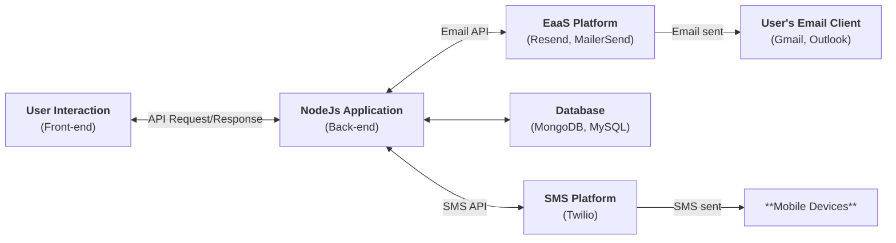

# Integrate Email and SMS platforms with Node.js

This repository demonstrates how to send emails and SMS messages through third-party service providers. It includes implementations for both Email as a Service (EaaS) platforms (**MailerSend**, **Resend**) and SMS platform (**Twilio**), serving as both a learning resource and a production-ready template.

## 📚 Table of Contents

- [Integrate Email and SMS platforms with Node.js](#integrate-email-and-sms-platforms-with-nodejs)
  - [📚 Table of Contents](#-table-of-contents)
  - [🎯 Overview](#-overview)
  - [⚙️ Tech Stack](#️-tech-stack)
  - [📁 Project Structure](#-project-structure)
  - [🚀 Setup \& Installation](#-setup--installation)
    - [Prerequisites](#prerequisites)
    - [Install and Running](#install-and-running)
  - [API Documentation](#api-documentation)
  - [📞 Resources](#-resources)
  - [👋 About the Author](#-about-the-author)
  - [🎉 Happy Testing](#-happy-testing)

## 🎯 Overview

Modern applications often send communications via third-party service providers rather than managing infrastructure directly. This project demonstrates both email and SMS integration patterns, showing how to:

- Send emails via multiple providers (MailerSend, Resend)
- Send SMS messages via Twilio
- Handle provider-specific features (templates, attachments, personalization)



## ⚙️ Tech Stack

- **Runtime**: Node.js 22.x or higher
- **Framework**: Express.js 5.1.0
- **Transpiler**: Babel 7.22.10 (ES6+ support)
- **Email Providers**:
  - MailerSend: 3.0.0
  - Resend: 6.12.4
- **SMS Providers**: Twilio 6.0.2
- **Environment Management**: dotenv 17.4.2 and dotenv-expand 13.0.0
- **Code Quality**: ESLint 8.47.0, Babel parser
- **Development**: Nodemon 3.0.1, module-resolver (path aliases)

## 📁 Project Structure

```md
./
├───.babelrc                    # Babel configuration
├───.eslintrc.cjs               # ESLint rules
├───jsconfig.json               # Path alias configuration
├───package.json                # Dependencies and scripts
├───.env.example                # Environment variables template
└───src
    ├───config
    ├───controllers
    ├───files                   # Static files for attachments
    ├───middlewares
    ├───models                  # Mock data for demo
    ├───providers               # Email and SMS integration
    ├───routes
    │   └───v1
    ├───utils
    │   └───mailTemplates.js    # Email template IDs
    └───server.js               # Express app initialization
```

## 🚀 Setup & Installation

### Prerequisites

- **Node.js** 22.x or higher
- **npm** 10.x or higher
- **yarn** v1.22.19 or higher
- A code editor (VS Code recommended)
- Service accounts (free tier available for all):
  - MailerSend - Email provider
  - Resend - Email provider
  - Twilio - SMS provider

### Install and Running

- Step 1: Clone repository

  ```bash
  git clone https://github.com/ngkhang-learning/email-and-sms-service-nodejs.git
  cd email-and-sms-service-nodejs
  ```

- Step 2: Install dependencies

  ```bash
  yarn run install
  # or
  npm install
  ```

- Step 3: Setup environment variables: Create a `.env` file based on `.env.example`

  ```text
  # ========== EMAIL PROVIDERS ==========

  # MailerSend Configuration
  MAILERSEND_API_KEY=your_mailersend_api_key_here
  MAILERSEND_ADMIN_SENDER_DOMAIN=your-verified-domain.com
  MAILERSEND_ADMIN_SENDER_NAME=Your App Name
  MAILERSEND_EMAIL_REGISTER=sender@your-verified-domain.com

  # Resend Configuration
  RESEND_API_KEY=your_resend_api_key_here
  RESEND_ADMIN_SENDER_EMAIL=onboarding@resend.dev
  RESEND_EMAIL_REGISTER=your-registered-email@gmail.com

  # ========== SMS PROVIDER ==========

  # Twilio Configuration
  TWILIO_ACCOUNT_ID=your_twilio_account_sid_here
  TWILIO_AUTH_TOKEN=your_twilio_auth_token_here
  TWILIO_FROM_NUMBER=+1234567890
  TWILIO_PHONE_NUMBER_REGISTERED=+84793506177
  ```

- Step 4: Running

  ```bash
  yarn run dev
  # or
  npm run dev
  # http://localhost:8017/v1
  ```

## API Documentation

- User Register Endpoint
  - Endpoint: `POST /v1/users/register`
  - Description: Creates a user account and sends welcome communications via email and SMS.
  - Request: (currently without parameters, uses mock data)

    ```bash
    curl -X POST http://localhost:8017/v1/users/register \
      -H "Content-Type: application/json"
    ```

## 📞 Resources

- **Email Providers:**
  - MailerSend: [Documentation](https://www.mailersend.com/docs) and [npm](https://www.npmjs.com/package/mailersend)
  - Resend: [Documentation](https://resend.com/docs) and [npm](https://www.npmjs.com/package/resend)

- **Sms Providers**:
  - Twilio [Twilio SMS API](https://www.twilio.com/docs/messaging)
  - [Twilio npm Package](https://www.npmjs.com/package/twilio)

- **Framework & Tools:**
  - [Express.js Documentation](https://expressjs.com/)
  - [Node.js Documentation](https://nodejs.org/docs/)

- **Testing & Development:**
  - [Postman (API Testing)](https://www.postman.com/)
  - [VS Code (Recommended Editor)](https://code.visualstudio.com/)

## 👋 About the Author

- **TrungQuanDev**

## 🎉 Happy Testing

This project demonstrates core communication service concepts. Use it as a foundation to understand EaaS and SMS workflows, then apply these principles to build secure, scalable production applications.

- ⭐ Starring the repository
- 📢 Sharing with others learning testing
