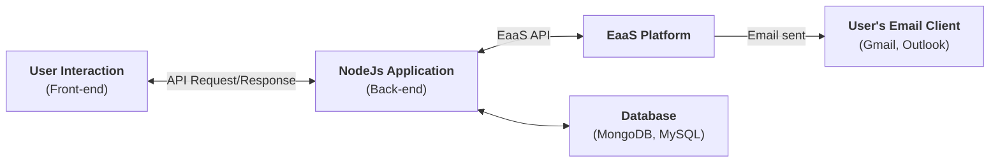

# Email as a Service (EaaS) with Node.js

This repository demonstrates how to send emails using Email as a Service (EaaS) platforms. It includes implementations for both **MailerSend** and **Resend**

## 📚 Table of Contents

- [Email as a Service (EaaS) with Node.js](#email-as-a-service-eaas-with-nodejs)
  - [📚 Table of Contents](#-table-of-contents)
  - [🎯 Overview](#-overview)
  - [⚙️ Tech Stack](#️-tech-stack)
  - [📁 Project Structure](#-project-structure)
  - [🚀 Setup \& Installation](#-setup--installation)
    - [Prerequisites](#prerequisites)
    - [Install and Running](#install-and-running)
  - [API Documentation](#api-documentation)
  - [📞 Resources](#-resources)
  - [👋 About the Author](#-about-the-author)
  - [🎉 Happy Testing](#-happy-testing)

## 🎯 Overview

This project demonstrates how modern applications send emails through third-party Email as a Service providers instead of managing SMTP servers directly. The architecture flow:



## ⚙️ Tech Stack

- **Runtime**: Node.js 22.x or higher
- **Framework**: Express.js 5.1.0
- **Transpiler**: Babel 7.22.10 (ES6+ support)
- **Email Providers**:
  - MailerSend: 3.0.0
  - Resend: 6.12.4
- **Environment Management**: dotenv 17.4.2 and dotenv-expand 13.0.0
- **Code Quality**: ESLint 8.47.0, Babel parser
- **Development**: Nodemon 3.0.1, module-resolver (path aliases)

## 📁 Project Structure

```md
./
├───.babelrc           # Babel configuration
├───.eslintrc.cjs      # ESLint rules
├───jsconfig.json      # Path alias configuration
├───package.json       # Dependencies and scripts
├───.env.example       # Environment variables template
└───src
    ├───config
    ├───controllers
    ├───files          # Static files (images for attachments)
    ├───middlewares
    ├───models         # Mock data for demo
    ├───providers      # MailerSend and Resend integration
    ├───routes
    │   └───v1
    ├───utils          # Template IDs and constants
    └───server.js      # Express app initialization
```

## 🚀 Setup & Installation

### Prerequisites

- **Node.js** 22.x or higher
- **npm** 10.x or higher
- **yarn** v1.22.19 or higher
- A code editor (VS Code recommended)
- Accounts with at least one EaaS provider:
  - MailerSend
  - Resend

### Install and Running

- Step 1: Clone repository

  ```bash
  git clone https://github.com/ngkhang-learning/eaas-email-nodejs.git
  cd eaas-email-nodejs
  ```

- Step 2: Install dependencies

  ```bash
  yarn run install
  # or
  npm install
  ```

- Step 3: Setup environment variables: Create a `.env` file based on `.env.example`
  - MailerSend: Requires a verified domain. During development, you can only send to emails registered in your MailerSend account.
  - Resend: For free accounts, you can only send from `onboarding@resend.dev` and to registered email addresses. Upgrade to Pro for custom domains.

- Step 4: Running

  ```bash
  yarn run dev
  # or
  npm run dev
  # http://localhost:8017/v1
  ```

## API Documentation

- User Register Endpoint
  - Endpoint: `POST /v1/users/register`
  - Description: Creates a user account and sends a welcome email via EaaS providers.
  - Request: (currently without parameters, uses mock data)

    ```bash
    curl -X POST http://localhost:8017/v1/users/register \
      -H "Content-Type: application/json"
    ```

## 📞 Resources

- **Email Providers:**
  - MailerSend: [Documentation](https://www.mailersend.com/docs) and [npm](https://www.npmjs.com/package/mailersend)
  - Resend: [Documentation](https://resend.com/docs) and [npm](https://www.npmjs.com/package/resend)

- **Framework & Tools:**
  - [Express.js Documentation](https://expressjs.com/)
  - [Node.js Documentation](https://nodejs.org/docs/)

- **Testing & Development:**
  - [Postman (API Testing)](https://www.postman.com/)
  - [VS Code (Recommended Editor)](https://code.visualstudio.com/)

## 👋 About the Author

- **TrungQuanDev**

## 🎉 Happy Testing

This project demonstrates core Email as a Service concepts. Use it as a foundation to understand EaaS workflows, then apply these principles to build secure, scalable production applications.

- ⭐ Starring the repository
- 📢 Sharing with others learning testing
